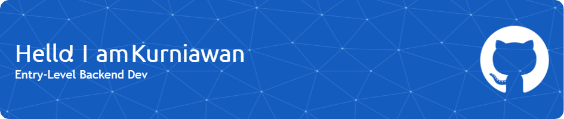

<!---
kurniawaanr/kurniawaanr is a ✨ special ✨ repository because its `README.md` (this file) appears on your GitHub profile.
You can click the Preview link to take a look at your changes.
--->

<h3 align="center">👩‍💻  About Me</h3> 

I'm Recent Bachelor's Informatics Graduate from Indonesia. Currently studying web development focusing on <b>Back End</b> things in order to eventually become a <b>Back End Web Developer</b> (for now). I have a goals, to become <b>DevOps Engineer</b> someday, so i also learn about this role and playing around with tools that used in <b>DevOps</b>.  
  - 🔭 I’m working as Creative Designer (looking for career change opportunity) 
  - 📚 I'm currently learning on JavaScript, NodeJS, Jenkins, & Kubernetes 

##

<h3 align="center">🛠 Language and tools that i've used and learn so far :</h3> 

###

  
  
  
  
  
  
  
  
  
  
  
  
  
  
  
  
  
  
  

###

  
  
  
  
  
  
  
  
  
  
  
  
  
  
  
  
  
  
  
  
  
  
  
  
  

##

<h3 align="center">My Stats :</h3>

###

  
  

##

<h3 align="center">Reach me :</h3>

###

  
  

###
